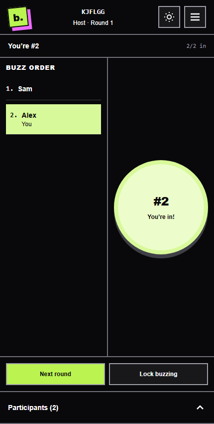

# bzzr

**First in. Game on.** A web buzzer for your next trivia night.

[](https://github.com/memarino92/bzzr/actions/workflows/ci.yml)
[](LICENSE)

One player hosts. Everyone joins with a six-character code or an invite link,
picks a name, and buzzes. The host resets for each question; everyone sees the
same order. Bring your own questions and keep your favorite video call open.

Built with **RedwoodSDK 1 · React 19 · Tailwind CSS 4 · Cloudflare Durable Objects**.
Production domain: [bzzr.app](https://bzzr.app).



## Run locally

Use Node 24+ and pnpm 11.19.0.

```sh
corepack enable
pnpm install --frozen-lockfile
pnpm generate
pnpm dev
```

Open [localhost:5173](http://localhost:5173). No secrets, database provisioning, or
Cloudflare account are required. Local workerd provides the same platform APIs.
Use separate browser profiles/private windows to act as different players;
tabs in one profile share identity.

## What is included

- Named host and players; link sharing and code entry.
- Host opens, resets, locks, and ends the room. The host can buzz too.
- Server-assigned order, duplicate protection, and stale-round rejection.
- Cookie-based reconnection, clear offline feedback, and keyboard controls.
- One independent room authority with hibernating WebSockets and alarm cleanup.
- A responsive game UI, Storybook, and tests at four boundaries.
- CI, dependency maintenance, contributor/AI instructions, and decision records.

Rooms support 60 people, retain only the current round, and clear after two hours
without game activity or 24 hours total. There are no accounts, questions, answers,
scores, or in-app calls in v1. Network latency can affect arrival order.

## Explore and verify

```sh
pnpm storybook                         # component workshop at localhost:6006
pnpm exec playwright install chromium  # once, for browser tests
pnpm check                             # types, lint, format, unit and workerd tests
pnpm test:coverage                     # coverage gates and HTML report
pnpm test:stories                      # Storybook interactions + accessibility
pnpm test:e2e                          # production build + multi-browser journeys
pnpm storybook:build                   # standalone Storybook
pnpm verify                            # full release-candidate verification
```

Storybook includes host/player views, waiting/open/locked rounds, results,
reconnections, errors, long names, a full room, and a playable local round.
The [visual direction](docs/design.md) brings a little 1990s game-night energy.
CI retains a downloadable static Storybook and test reports.
[Testing scope and limitations](docs/testing.md) · [Initial verification record](docs/verification.md)

## Why this architecture

A room code maps directly to a Durable Object; there is no global registry to
bottleneck traffic. That object authenticates players, serializes buzzes, and
persists the current round before broadcasting. Hibernation keeps idle connections
without a running server loop. Alarms close sockets and delete stored room data.

The domain is plain TypeScript. Cloudflare adapters, browser lifecycle, and
presentation are separate, so each can be tested where its guarantees live.
[Architecture](docs/architecture.md) · [Cost model](docs/operations.md)

## Read the project

| Topic                                        | Guide                                                                                       |
| -------------------------------------------- | ------------------------------------------------------------------------------------------- |
| Architecture and boundaries                  | [Architecture](docs/architecture.md)                                                        |
| HTTP and WebSocket contract                  | [Protocol](docs/protocol.md)                                                                |
| Platform, lifecycle, auth, testing tradeoffs | [Decision records](docs/decisions/README.md)                                                |
| Cloudflare setup, release and rollback       | [Deployment](docs/deployment.md)                                                            |
| Resource limits, cost and incident response  | [Operations](docs/operations.md)                                                            |
| Test layers and artifacts                    | [Testing](docs/testing.md)                                                                  |
| Human and AI contributions                   | [Contributing](CONTRIBUTING.md), [AGENTS.md](AGENTS.md), [AI workflow](docs/ai-workflow.md) |
| Scope and future work                        | [Roadmap](docs/roadmap.md), [Changelog](CHANGELOG.md)                                       |
| Vulnerabilities and privacy boundaries       | [Security](SECURITY.md)                                                                     |

## License

Original bzzr code is [MIT](LICENSE). Third-party components retain their own licenses; see [third-party notices](THIRD_PARTY_NOTICES.md).
