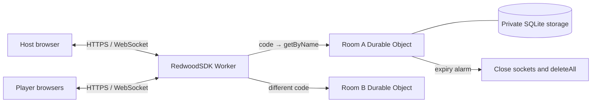

# Architecture

bzzr has one authority for each room, with no central room directory.

## Boundaries

| Location                       | Responsibility                                                      |
| ------------------------------ | ------------------------------------------------------------------- |
| src/domain                     | Pure room state machine, validation, limits, public protocol        |
| src/server/api.ts              | HTTP routes, same-origin checks, rate limits, capability cookies    |
| src/server/BuzzerRoom.ts       | Serialized room authority, persistence, hibernating sockets, alarms |
| src/server/http.ts             | Bounded JSON, error responses, token generation and hashing         |
| src/app/hooks/useRoom.ts       | Session and UI state, pending command handling                      |
| src/app/lib/room-connection.ts | Single socket lifecycle, backoff, health and cleanup                |
| src/app/components             | Presentational game UI and copied Catalyst primitives               |
| src/app/pages                  | Server-rendered document routes                                     |
| tests/integration/worker.ts    | Test-only entry for production API and Durable Object adapters      |

RedwoodSDK renders a small server shell and hydrates client forms/room controls.
Storybook renders the same presentation components without a server or real room.
Live RoomClient passes snapshots and command callbacks through RoomView to PlayView.
Storybook examples supply simulated state to that same presentation. Browser hooks
keep appearance and handedness preferences on the device; they never affect room
roles, rounds, or buzz order. See [ADR 0005](decisions/0005-mobile-play.md).

## Lifecycle

1. Host POSTs a name. The Worker validates Origin and rate limits, generates a code
   and capability, and asks that room object to initialize. A live collision retries.
2. The response sets a private cookie and returns the public code.
3. Guests join by code or link. The object validates uniqueness/capacity and stores
   a participant. Repeated joins with an existing capability reuse that identity.
4. An authenticated upgrade adds a hibernatable socket with a serialized participant
   attachment. The room broadcasts a snapshot, deriving presence from open sockets.
5. Every accepted game mutation persists before its broadcast. One room sees one
   ordered stream; reset compares the client's round to reject stale packets.
6. Activity updates an expiry alarm. End/expiry closes sockets and deletes all
   room storage. Lookups of missing codes do not allocate persistent state.

## State and consistency

Explicit departure removes the authenticated membership and current buzz before
notifying its sockets and broadcasting the remaining roster. Hosting transfers
in join order; the last player's departure closes the room. Disconnects still
preserve membership. See [ADR 0009](decisions/0009-explicit-departure.md).

The /room/CODE/spectate route selects presentation per tab, independently of the
cookie identity. Host/player sessions can therefore project results and continue
playing simultaneously. See [ADR 0008](decisions/0008-spectator-tabs.md).

Nameless spectators use separate capability records (up to 120), without taking
one of the 60 player slots. They receive the same public snapshots over hibernating
sockets and cannot execute game commands or extend expiry. Missing spectator lists
in existing schema-v1 records default to empty. See [ADR 0007](decisions/0007-spectators-and-qr.md).

The versioned record has names, roles, token hashes, timestamps, current round,
status, and at most one buzz per participant. It is a bounded SQLite-backed KV
record, not a growing event log. No external I/O participates in a state transition.

Durable Object input/output gates coordinate storage operations. State is restored
in constructor blockConcurrencyWhile. After the join handler's request-body
await, it reads the latest room again before mutation. Integration tests exercise
75 simultaneous joins, real eviction, and restored socket attachments.

Buzz order means server arrival order. Two distant clients can experience unequal
latency. Client clocks and timestamps are never used as tie-breakers.

## Deployment and evolution

Wrangler v1 preserves the old starter's SessionDurableObject migration; v2 adds
BuzzerRoom. The legacy class remains exported but does not issue new sessions.
Do not rewrite migration history. See [deployment](deployment.md).

Version the stored schema and protocol deliberately before introducing rolling
incompatibilities. Future scoring, questions, accounts, or in-app calls need new
decisions and should not silently expand v1 retention.

See [ADR 0001](decisions/0001-platform-and-boundaries.md),
[ADR 0002](decisions/0002-room-authority-and-lifecycle.md), and
[ADR 0003](decisions/0003-capabilities-and-abuse-controls.md).
